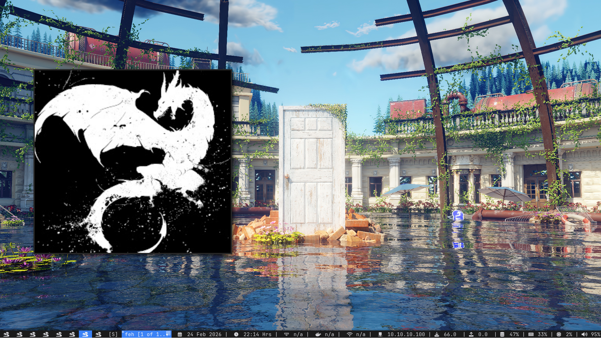

# Dotfiles - DWM Edition



This repository contains my personal configuration files for a lightweight and minimalist desktop environment based on **dwm** on **Arch Linux. It features several plugins and patches, all of which can be installed via the included installation script.**

## Main Components

> **Recommendation:** Install KDE and XFCE4 for better convenience.
> **Note:** Some add-ons must be installed independently.

* **Window Manager:** [dwm](https://dwm.suckless.org/) (Dynamic Window Manager)
* **Terminal:** [kitty](https://www.google.com/search?q=https://sw.kovidgoyal.net/kitty/)
* **App Launcher:** [rofi](https://www.google.com/search?q=https://github.com/davatorium/rofi)
* **Compositor:** Picom (transparency and shadows)
* **Fonts:** JetBrainsMono Nerd Font

## Installation

> **Warning:** Do not run the installation scripts without previously reviewing the files. These dotfiles are tailored to my specific workflow.

### 1. Prerequisites

Install the basic build dependencies on Arch:

```bash
sudo pacman -S base-devel git libx11 libxinerama libxft webkit2gtk

```

### 2. Clone the Repository

```bash
git clone https://github.com/crahantan/dotfiles_dwm.git
cd dotfiles_dwm

```

### 3. Build and Install

You must run the `install.sh` script:

> **Note:** The script includes all necessary dependencies; just run it.

```bash
# Install dwm and components
sudo ./install.sh 

```

## Basic Keybindings

The main **Mod** key is `Super` (Windows Key).

* `Mod + Enter` -> Open terminal (kitty)
* `Mod + d` -> Launch rofi
* `Mod + Shift + q` -> Close window (Kill)
* `Mod + j / k` -> Navigate between windows
* `Mod + h / l` -> Resize master area
* `Mod + Shift + e` -> Refresh dwm

## Customization

To modify colors or behavior:

1. Edit the `config.h` file in the corresponding folder.
2. Recompile with `sudo make clean install`.
>**Note:** You can use config.def.h as a draw.

---

Created by [crahantan](https://www.google.com/search?q=https://github.com/crahantan)

---
